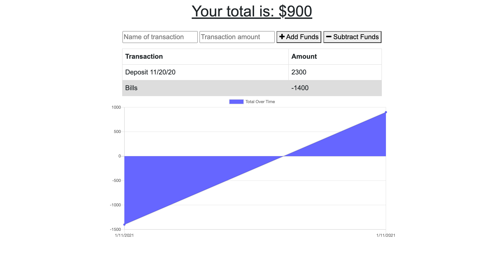

# Budget Tracker

### Description
Simple registry to keep track of your funds

### Live Demo
[Budget Tracker](https://mobile-wally.herokuapp.com/)

## Table of contents
* [Description](#Description)
* [Deployed Application](#Live Demo)
* [Version](#Version)
* [Features](#Features)
* [Installation](#Installation)
* [Usage](#Usage)
* [Technologies](#Technologies)
* [License](#License)

### Version 
1.0.0

### Features
Keeps track of deposits, withdrawals, and spending. small graph feature to help visualize activity overtime.

## Installation
git fork and/or clone the repo. Initialize with 

    npm install
    npm start

### Technologies
* Webpack
* Compression
* express
* lite-server
* mogoose
* morgan

## Questions
Follow me on GitHub:  

## License
MIT © Ted Peters

